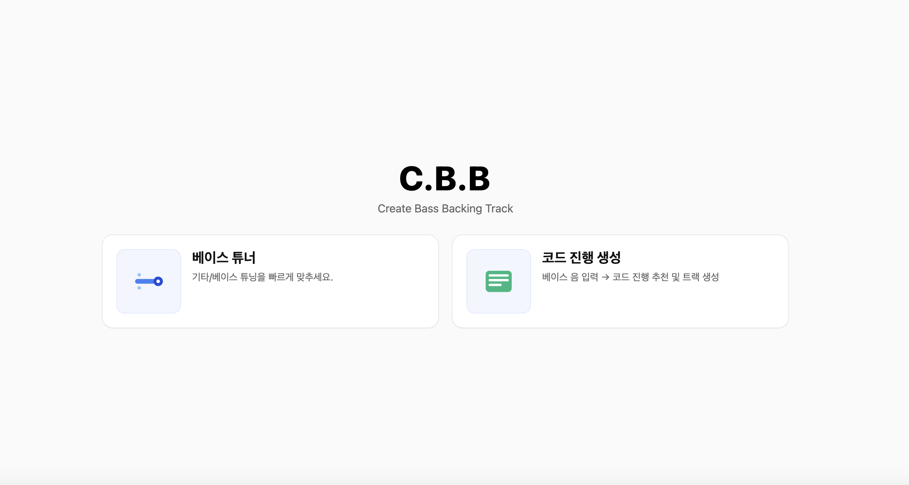
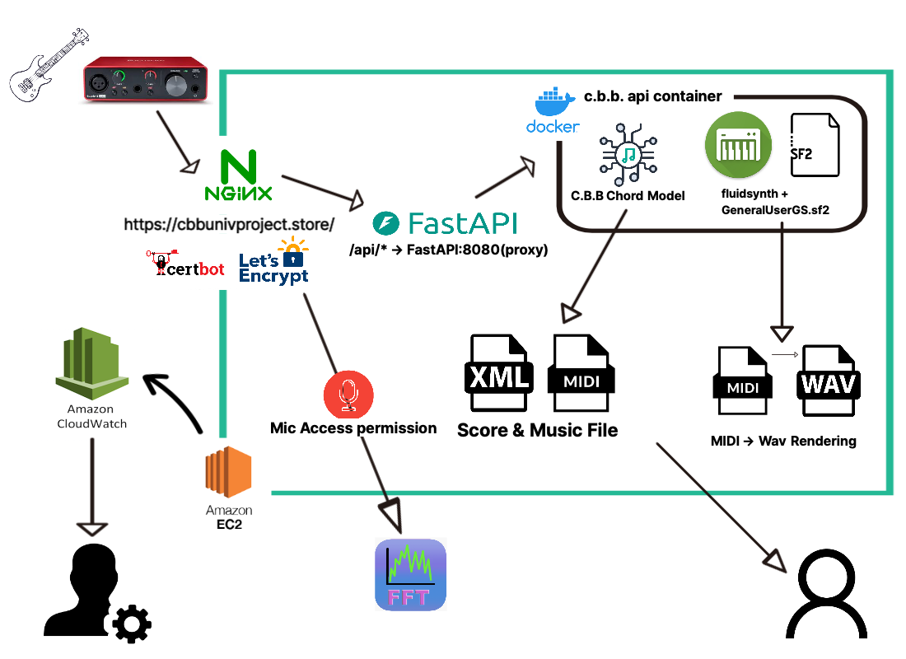
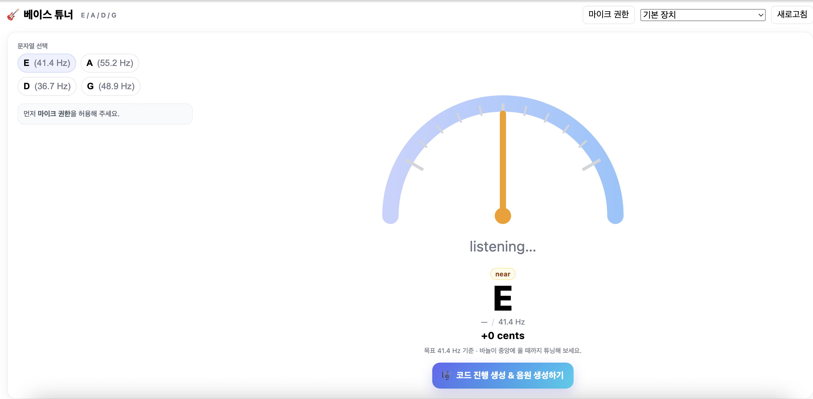
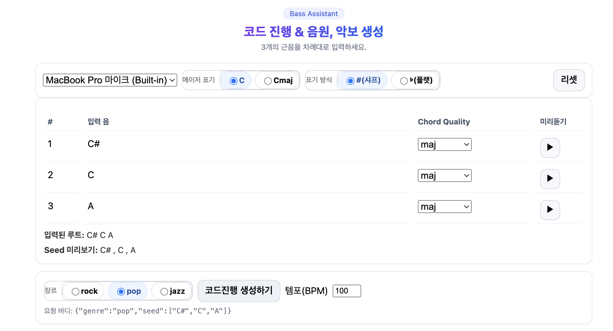
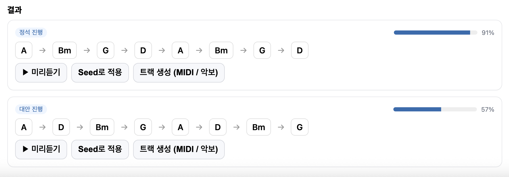
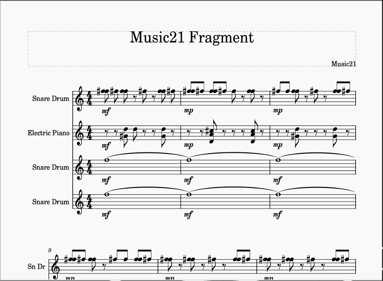
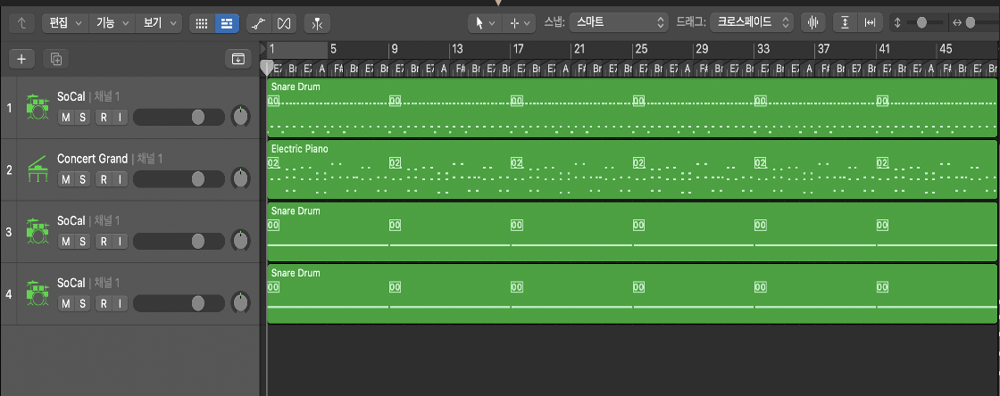
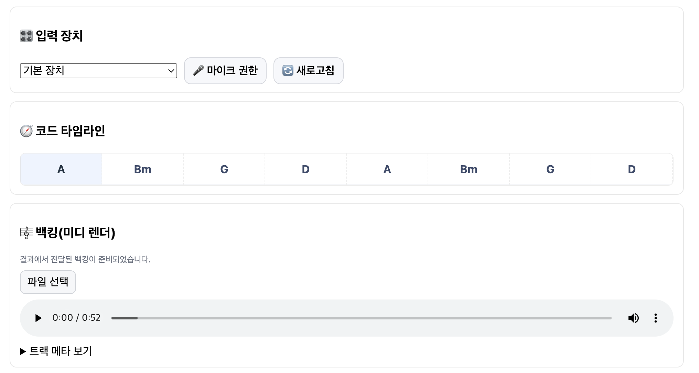

# C.B.B – Create Bass BackingTrack 🎸
실시간 튜너(FFT) · 코드 진행 생성(LSTM) · 자동 반주(MIDI/악보/WAV) · 웹 서비스

**배포:** https://cbbunivproject.store  · **API 문서:** https://cbbunivproject.store/docs

---

## 목차
- [프로젝트 소개](#프로젝트-소개)
- [주요 기능](#주요-기능)
- [시스템 아키텍처](#시스템-아키텍처)
- [기술 스택](#기술-스택--선택-이유)
- [빠른 시작(로컬)](#빠른-시작로컬)
- [Docker 배포](#docker-배포)
- [AWS 배포(요약)](#aws-배포요약)
- [환경 변수](#환경-변수)
- [API 개요](#api-개요)
- [모델/데이터](#모델데이터)
- [문제 해결(트러블슈팅)](#문제-해결트러블슈팅)
- [로드맵](#로드맵)
- [라이선스 & 크레딧](#라이선스--크레딧)

---

## 프로젝트 소개
C.B.B(Create Bass BackingTrack)는 기타/베이스 연주자를 위한 **올인원 웹 도구**입니다.  
웹에서 마이크 입력으로 **튜닝**하고, **장르별 코드 진행**을 추천받아 **자동 반주**(드럼/컴핑/베이스)를 생성합니다. 결과는 **MIDI / MusicXML / WAV**로 내려받을 수 있습니다.

### Main Page

### System Architecture


- **User(HTTPS)** ⇄ **Nginx**(정적 파일 & `/api` 프록시) ⇄ **FastAPI**  
- FastAPI ⇄ **PyTorch(LSTM)**, **SongMaker 규칙 엔진**, **FluidSynth**  
- 산출물: `/recordings` 볼륨에 MIDI/WAV/XML 저장


---

## 기술 스택
<p align="center">
  
</p>

**Frontend**: Vite(React/TS) – 빠른 HMR, 생산성 높은 빌드 체인  
**Backend**: FastAPI – 타입 기반 설계, 자동 문서화, 비동기 성능  
**ML**: PyTorch – LSTM 구현·추론 용이, CPU 배포 친화  
**Music**: `music21`, `pretty_midi` – MIDI/악보 처리 표준 라이브러리  
**Audio**: FluidSynth + **GeneralUserGS.sf2** – 경량·재현 가능한 렌더  
**Infra**: Docker + Nginx + EC2 – 프리티어/저비용, **이미지 동결로 재현성 확보**  
**Monitoring**: CloudWatch Logs – 중앙 로그/알람

---

## 주요 기능
1) **튜너(FFT)**  
   - WebAudio + `getUserMedia`(HTTPS 필요) → **실시간 FFT** 기반 기본 주파수 추정  
   - 기타/베이스 표준 튜닝 프리셋, 노이즈 억제·평활화 적용
   

2) **코드 진행 생성 (LSTM + 룰 블렌딩)**  
   - 장르별 정규화된 코드 토큰 데이터셋으로 LSTM 학습  
   - **정석 진행 1 + 대안 진행 2** Top-K 제안  
   - **MMR 다양성 선택** + **bucketize(상·중·하)** 점수 보정
   
   

3) **음원/악보 생성**  
   - 장르 프리셋(템포·그루브·악기) + 리듬 패턴 조합  
   - `music21`, `pretty_midi`로 MIDI / MusicXML 생성
   
   

4) **MIDI → WAV 렌더(FluidSynth)**  
   - 컨테이너에 **GeneralUserGS.sf2** 포함 → 재현성 보장  
   - `POST /api/render/midi-to-wav` 업로드 → WAV 반환

5) **배포/운영**  
   - Nginx 리버스 프록시(정적·/api 분리), Let’s Encrypt(TLS), Docker Compose

---


## 빠른 시작(로컬)
```bash
# 1) 의존성
docker -v
docker compose version

# 2) .env 준비 (루트 경로)
cp .env.example .env
# 컨테이너 내부 경로 기준으로 값 확인(아래 [환경 변수] 참고)

# 3) 프런트 빌드(정적 파일)
cd frontend
npm ci
npm run build
cd ..

# 4) 컨테이너 올리기
docker compose up -d --build

# 프런트: http://localhost
# 백엔드 Swagger: http://localhost/docs
```

---

## Docker 배포
```bash
# 이미지 빌드 & 기동
docker compose up -d --build

# 상태/로그
docker compose ps
docker compose logs -f cbb-api
docker compose logs -f nginx

# 재배포
docker compose up -d --force-recreate
```

**Nginx 볼륨 예시**
- `./frontend/dist:/usr/share/nginx/html:ro` – 정적 파일 서빙
- `./nginx/conf.d:/etc/nginx/conf.d:ro` – 프록시 설정

---

## AWS 배포 요약
- **EC2 (t3.micro)** 1대, 보안그룹: 80/443(HTTP/HTTPS), 22(SSH)  
- **Docker / Compose** 설치 → 레포 동기화(`/opt/New_LSTM`)  
- **Let’s Encrypt**(certbot webroot)로 TLS 발급  
- **CloudWatch Logs**: `awslogs` 드라이버 + IAM Role

---

## 환경 변수
> **중요:** 경로는 **컨테이너 내부 기준**입니다. (이미지에 모델/사운드폰트 포함)

`.env` (루트)
```
# 모델 디렉토리(컨테이너 경로)
CBB_MODEL_JAZZ=/app/app/assets/model/jazz
CBB_MODEL_ROCK=/app/app/assets/model/rock
CBB_MODEL_POP=/app/app/assets/model/pop

# LSTM 임시 데이터(JSON) 저장 경로
CBB_DATA_DIR=/app/LSTM/cli/data

# 산출물 저장 폴더
CBB_RECORDINGS_DIR=/recordings

# 사운드폰트(REST 렌더/스코어 공용)
SF2_PATH=/app/app/assets/sf2/GeneralUserGS.sf2
CBB_SOUNDFONT_PATH=/app/app/assets/sf2/GeneralUserGS.sf2
```


---

## API 개요
- **Swagger**: `/docs`
- (예시)  
  - `POST /api/chords/topk` : 장르·시드 입력 → 상위 3개 진행  
  - `POST /api/tracks/generate` : 진행/옵션 → MIDI/XML 생성  
  - `POST /api/render/midi-to-wav` : MIDI 업로드 → WAV 반환  
> 실제 파라미터/스키마는 Swagger를 참고하세요.

---

## 모델/데이터
- **전처리**: 장르별 코드 심볼을 **루트/종류/장식**으로 정규화 → `.npy(X,y)`  
- **모델**: LSTM(시퀀스 예측), CPU 추론  
- **후처리**: 룰 기반 후보 + **MMR 다양성 선택**  
- **점수 보정**: `bucketize_three`로 상/중/하 퍼센타일 보정(가독성 향상)

---

## 문제 해결(트러블슈팅)
- **루트(`/`) 404** → Nginx에서 루트를 `/docs`로 리다이렉트하거나, 정적 루트 설정(`root /usr/share/nginx/html;`) 확인  
- **마이크 기기 목록이 안 뜸** → 브라우저 보안 정책상 **HTTPS 필요**  
- **`python-multipart` 오류** → `requirements.txt`에 추가되어 있는지 확인  
- **`fluidsynth` 미설치** → 컨테이너에서 `apt-get install -y fluidsynth libsndfile1`  
- **SoundFont 미발견** → `.env`의 `SF2_PATH`가 **컨테이너 내부 경로**인지 확인  
- **CloudWatch 로그 미수집** → `awslogs-region/group/stream` 확인 + EC2 IAM Role(CloudWatchLogsFullAccess 최소 권한) 연결  
- **Compose 경고: version obsolete** → `version:` 키 제거(Compose v2는 불필요)


---

## 라이선스 & 크레딧
- 라이선스: MIT 
- SoundFont: **GeneralUserGS.sf2** (개별 라이선스 준수)  
- Thanks: PyTorch, FastAPI, music21, pretty_midi, FluidSynth, Vite/React, AWS, 그리고 커뮤니티 & GPT 🙏
